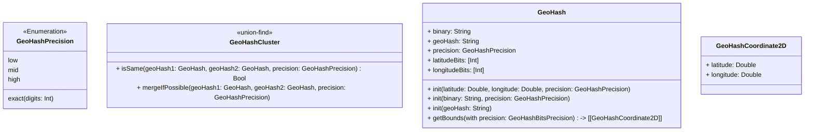

# GeoHashSwift

GeoHashSwift is a Swift implementation of GeoHash.


## Installation & Usage

### GeoHashFramework

GeoHashFramework is a framework for GeoHash.

You can use it as a dependency of your project.

```swift
dependencies: [
    .package(url: "https://github.com/fummicc1/GeoHashSwift.git", from: "0.0.1")
]
```

```swift
import GeoHashFramework

let geoHash = GeoHash(latitude: 35.681382, longitude: 139.766084, precision: .mid)
print(geoHash.geoHash) // "xn76urwe"
```

### GeoHashCLI

GeoHashCLI executable is a CLI tool for GeoHash.

You can use it to generate GeoHash from latitude and longitude.

<!--

- Install via Homebrew (not yet available)

```sh
brew tap fummicc1/geohash-swift
brew install geohash-swift
```

Usage:

```sh
# Generate GeoHash from latitude and longitude
geohash 35.681236 139.767125
# Generate GeoHash from coordinate2d
geohash --coordinate "35.681236,139.767125"
```

-->

- Install via Swift Package Manager

```swift
dependencies: [
    .package(url: "https://github.com/fummicc1/GeoHashSwift.git", from: "0.0.1")
]
```

Usage:

```sh
# Generate GeoHash from latitude and longitude
swift run geohash 35.681236 139.767125
# Generate GeoHash from coordinate2d
swift run geohash --coordinate "35.681236,139.767125"
```

## APIs

### Models

#### GeoHash

A GeoHash is a GeoHash object.

You can retrieve both binary and hex values of coordinate.

More implementation related to Coordinate2D (latitude, longitude) is in GeoHashCoordinate2D.swift.

#### GeoHashCoordinate2D

A GeoHashCoordinate2D represents a pair of latitude and longitude in binary.

Note that actual latitude and longitude are not stored in this object, because the accuracy of GeoHash is not guaranteed in spite of the introduction of store of binary integer.

### GeoHashCluster

A GeoHashCluster is a union-find data structure for GeoHash.

This object aims to store GeoHash and their relations.



### Features

- User can generate GeoHash from:
  - latitude and longitude
  - binary string
  - GeoHash string
- User can retrieve hash string from `GeoHash` object.
- User can check if two GeoHash objects are in the same cluster with specified precision.
- User can fetch GeoHashes in the same cluster with specified GeoHash.


## Related Repositories

- [GeoHashDebugView: An example app using GeoHashSwift](https://github.com/fummicc1/GeoHashDebugView)
