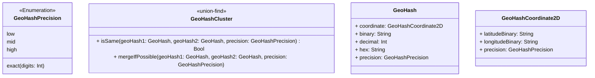

# GeoHashSwift

GeoHashSwift is a Swift implementation of GeoHash.

by storing GeoHash in a union-find data structure, and store raw data as binary not hex string, improving the accuracy of GeoHash comparison.

## APIs

### Models

#### GeoHash

A GeoHash is a GeoHash object.

You can retrieve both binary and hex values of coordinate.

More implementation related to Coordinate2D (latitude, longitude) is in GeoHashCoordinate2D.swift.

#### GeoHashCoordinate2D

A GeoHashCoordinate2D represents a pair of latitude and longitude in binary.

Note that actual latitude and longitude are not stored in this object, because the accuracy of GeoHash is not guaranteed in spite of the introduction of store of binary integer.

### GeoHashCluster

A GeoHashCluster is a union-find data structure for GeoHash.

This object aims to store GeoHash and their relations.

### Features

- User can generate GeoHash from:
  - latitude and longitude
  - binary string
  - hex string
- User can retrieve hex (a.k.a geoHash) from `GeoHash` object.
- User can find if two GeoHash objects are in the same cluster with specified precision.
